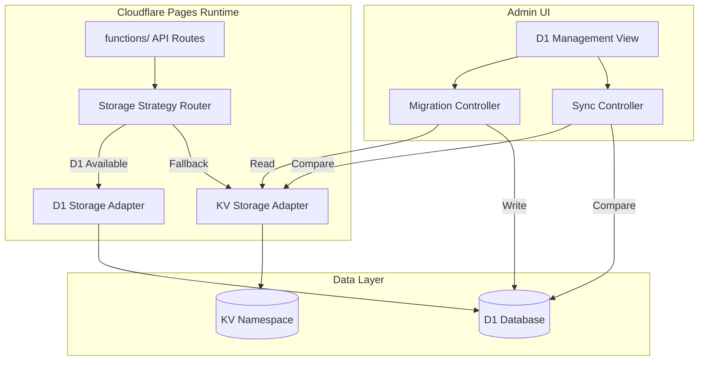

# D1 数据库自动切换与数据同步

Feature Name: d1-database-switch-sync
Updated: 2026-06-14

## Description

为 特控tele 项目增加 Cloudflare D1 数据库支持，实现：
1. Cloudflare Pages 模式下从 KV 元数据存储平滑切换到 D1
2. 运行时自动检测并切换存储后端
3. 后台管理界面提供迁移、同步、状态查看操作
4. KV 与 D1 之间的数据一致性保障

## Architecture



## Components and Interfaces

### 1. D1 Storage Adapter (`functions/lib/d1-storage.js`)

通过环境变量 `D1_BINDING_NAME` 指定 D1 binding，实现与现有 KV 存储相同的接口：

```javascript
export class D1Storage {
  constructor(db) { this.db = db; }

  async getFileMeta(id) {
    const { results } = await this.db.prepare(
      "SELECT * FROM files WHERE id = ?"
    ).bind(id).all();
    return results[0] || null;
  }

  async setFileMeta(id, meta) {
    await this.db.prepare(
      `INSERT INTO files (id, storage_type, storage_key, file_name, file_size,
       mime_type, folder_path, extra_json, created_at, updated_at)
       VALUES (?, ?, ?, ?, ?, ?, ?, ?, ?, ?)
       ON CONFLICT(id) DO UPDATE SET
         storage_type = ?, storage_key = ?, file_name = ?, file_size = ?,
         mime_type = ?, folder_path = ?, extra_json = ?, updated_at = ?`
    ).bind(id, meta.storage_type, meta.storage_key, meta.file_name,
          meta.file_size, meta.mime_type, meta.folder_path,
          JSON.stringify(meta.extra || {}), meta.created_at, meta.updated_at,
          meta.storage_type, meta.storage_key, meta.file_name, meta.file_size,
          meta.mime_type, meta.folder_path,
          JSON.stringify(meta.extra || {}), meta.updated_at).run();
  }

  async deleteFileMeta(id) {
    await this.db.prepare("DELETE FROM files WHERE id = ?").bind(id).run();
  }

  async listFiles({ cursor, limit = 50, folderPath = '' }) {
    let sql = "SELECT * FROM files";
    const params = [];
    if (folderPath) {
      sql += " WHERE folder_path = ? OR folder_path LIKE ?";
      params.push(folderPath, `${folderPath}%`);
    }
    sql += " ORDER BY created_at DESC LIMIT ?";
    params.push(limit);
    if (cursor) {
      sql = sql.replace("LIMIT ?", "WHERE created_at < ? ORDER BY created_at DESC LIMIT ?");
      params.unshift(Number(cursor));
    }
    const { results } = await this.db.prepare(sql).bind(...params).all();
    return {
      files: results,
      cursor: results.length === limit ? results[results.length - 1].created_at : null,
    };
  }

  async healthCheck() {
    try {
      await this.db.prepare("SELECT 1").run();
      return { ok: true, type: 'd1' };
    } catch {
      return { ok: false, type: 'd1' };
    }
  }
}
```

### 2. Storage Strategy Router (`functions/lib/storage-router.js`)

运行时自动选择存储后端，支持双向同步：

```javascript
export function createStorageRouter(env) {
  const d1Available = env.DB && env.DB.prepare;
  const kvAvailable = env.img_url;
  const syncMode = env.D1_SYNC_MODE || 'bidirectional'; // 'kv-to-d1' | 'd1-to-kv' | 'bidirectional'

  if (d1Available) {
    return {
      primary: 'd1',
      instance: new D1Storage(env.DB),
      fallback: kvAvailable ? new KVStorage(env.img_url) : null,
      syncMode,
    };
  }

  return { primary: 'kv', instance: new KVStorage(env.img_url), fallback: null, syncMode };
}

export async function storageOperation(router, operation, ...args) {
  try {
    const result = await router.instance[operation](...args);

    // 双向同步
    if (router.syncMode === 'bidirectional' && router.fallback && operation === 'setFileMeta') {
      router.fallback[operation](...args).catch((err) => {
        console.warn('Sync to fallback failed:', err.message);
      });
    }

    return result;
  } catch (err) {
    if (router.fallback) {
      console.warn(`Primary storage failed, falling back:`, err.message);
      return await router.fallback[operation](...args);
    }
    throw err;
  }
}
```

### 3. D1 Schema Migration (`functions/lib/d1-schema.js`)

D1 表结构初始化：

```javascript
export const D1_SCHEMA = `
CREATE TABLE IF NOT EXISTS storage_configs (
  id TEXT PRIMARY KEY,
  type TEXT NOT NULL,
  name TEXT,
  is_default INTEGER DEFAULT 0,
  enabled INTEGER DEFAULT 1,
  encrypted_payload TEXT,
  created_at INTEGER,
  updated_at INTEGER
);

CREATE TABLE IF NOT EXISTS files (
  id TEXT PRIMARY KEY,
  storage_config_id TEXT,
  storage_type TEXT NOT NULL,
  storage_key TEXT NOT NULL,
  file_name TEXT NOT NULL,
  file_size INTEGER NOT NULL,
  mime_type TEXT,
  folder_path TEXT DEFAULT '/',
  list_type TEXT DEFAULT 'file',
  label TEXT,
  liked INTEGER DEFAULT 0,
  extra_json TEXT DEFAULT '{}',
  created_at INTEGER NOT NULL,
  updated_at INTEGER NOT NULL
);

CREATE TABLE IF NOT EXISTS virtual_folders (
  path TEXT PRIMARY KEY,
  parent_path TEXT,
  file_count INTEGER DEFAULT 0,
  created_at INTEGER,
  updated_at INTEGER
);

CREATE TABLE IF NOT EXISTS sessions (
  token TEXT PRIMARY KEY,
  user_agent TEXT,
  ip_hash TEXT,
  expires_at INTEGER NOT NULL,
  created_at INTEGER
);

CREATE TABLE IF NOT EXISTS guest_upload_counters (
  ip_hash TEXT PRIMARY KEY,
  date TEXT NOT NULL,
  count INTEGER DEFAULT 0,
  updated_at INTEGER
);

CREATE TABLE IF NOT EXISTS chunk_uploads (
  task_id TEXT PRIMARY KEY,
  file_name TEXT,
  file_size INTEGER,
  chunk_size INTEGER,
  total_chunks INTEGER,
  uploaded_chunks TEXT DEFAULT '[]',
  status TEXT DEFAULT 'pending',
  expires_at INTEGER,
  created_at INTEGER,
  updated_at INTEGER
);

CREATE TABLE IF NOT EXISTS app_settings (
  key TEXT PRIMARY KEY,
  value_json TEXT,
  updated_at INTEGER
);

CREATE INDEX IF NOT EXISTS idx_files_folder ON files(folder_path);
CREATE INDEX IF NOT EXISTS idx_files_created ON files(created_at DESC);
CREATE INDEX IF NOT EXISTS idx_files_storage_type ON files(storage_type);
`;

export async function initD1Schema(db) {
  const statements = D1_SCHEMA.split(';').filter(s => s.trim());
  for (const stmt of statements) {
    await db.prepare(stmt).run();
  }
}
```

### 4. KV to D1 Migration Service (`functions/lib/kv-to-d1-migration.js`)

```javascript
export class KVToD1Migration {
  constructor(kv, d1) {
    this.kv = kv;
    this.d1 = d1;
  }

  async migrate({ batchSize = 50, resumeCursor = null } = {}) {
    let cursor = resumeCursor;
    let totalMigrated = 0;
    let totalSkipped = 0;
    let totalFailed = 0;

    while (true) {
      const { keys, list_complete, cursor: nextCursor } = await this.kv.list({
        prefix: 'file:',
        limit: batchSize,
        cursor: cursor || undefined,
      });

      for (const key of keys) {
        try {
          const meta = await this.kv.get(key.name, 'json');
          if (!meta) { totalSkipped++; continue; }

          const fileId = key.name.replace('file:', '');
          await this.d1.setFileMeta(fileId, meta);
          totalMigrated++;
        } catch (err) {
          console.error(`Migration failed for ${key.name}:`, err);
          totalFailed++;
        }
      }

      cursor = nextCursor;
      if (!list_complete || !cursor) break;
    }

    // Migrate paste data
    const pasteKeys = await this.kv.list({ prefix: 'paste:', limit: 1000 });
    for (const key of pasteKeys.keys) {
      try {
        const content = await this.kv.get(key.name, 'text');
        if (content) {
          const pasteId = key.name.replace('paste:', '');
          await this.d1.db.prepare(
            "INSERT OR IGNORE INTO app_settings (key, value_json, updated_at) VALUES (?, ?, ?)"
          ).bind(`paste:${pasteId}`, JSON.stringify({ content, createdAt: Date.now() }), Date.now()).run();
        }
      } catch { totalFailed++; }
    }

    return { totalMigrated, totalSkipped, totalFailed, completed: true };
  }

  async syncDiff({ direction = 'kv-to-d1' } = {}) {
    const kvFiles = await this.kv.list({ prefix: 'file:', limit: 1000 });
    const d1Files = await this.d1.db.prepare("SELECT id, updated_at FROM files").all();
    const d1Map = new Map(d1Files.results.map(r => [r.id, r.updated_at]));

    const missing = [];
    const outdated = [];

    for (const key of kvFiles.keys) {
      const fileId = key.name.replace('file:', '');
      if (!d1Map.has(fileId)) {
        missing.push(fileId);
      } else if (key.metadata?.updatedAt && d1Map.get(fileId) < key.metadata.updatedAt) {
        outdated.push(fileId);
      }
    }

    return { missing, outdated, kvCount: kvFiles.keys.length, d1Count: d1Files.results.length };
  }
}
```

### 5. Admin API Routes (`functions/api/admin/d1/`)

#### `/api/admin/d1/status`
```javascript
export async function handleD1Status(request, env) {
  const d1 = env.DB;
  if (!d1) return new Response(JSON.stringify({ available: false }), { status: 501 });

  const fileCount = await d1.prepare("SELECT COUNT(*) as count FROM files").first();
  const storageCount = await d1.prepare("SELECT COUNT(*) as count FROM storage_configs").first();

  return new Response(JSON.stringify({
    available: true,
    fileCount: fileCount.count,
    storageCount: storageCount.count,
    tables: ['files', 'storage_configs', 'virtual_folders', 'sessions', 'app_settings'],
  }));
}
```

#### `/api/admin/d1/migrate`
```javascript
export async function handleD1Migrate(request, env) {
  const migration = new KVToD1Migration(env.img_url, new D1Storage(env.DB));
  const result = await migration.migrate();
  return new Response(JSON.stringify(result));
}
```

#### `/api/admin/d1/sync`
```javascript
export async function handleD1Sync(request, env) {
  const migration = new KVToD1Migration(env.img_url, new D1Storage(env.DB));
  const diff = await migration.syncDiff();
  return new Response(JSON.stringify(diff));
}
```

## Data Models

### D1 表结构（与 SQLite 对齐）

| 表名 | 用途 | 关键字段 |
|------|------|----------|
| `files` | 文件元数据 | id, storage_type, storage_key, file_name, folder_path |
| `storage_configs` | 存储后端配置 | id, type, encrypted_payload |
| `virtual_folders` | 虚拟文件夹 | path, parent_path, file_count |
| `sessions` | 认证会话 | token, expires_at |
| `guest_upload_counters` | 访客限流 | ip_hash, date, count |
| `chunk_uploads` | 分片上传 | task_id, status, uploaded_chunks |
| `app_settings` | 应用设置 | key, value_json |

## Correctness Properties

1. **幂等性**: 迁移操作可重复执行，不会产生重复数据
2. **一致性**: KV 和 D1 之间的文件元数据保持最终一致
3. **可用性**: D1 不可用时自动回退到 KV，服务不中断
4. **完整性**: 迁移过程包含所有前缀（file:, paste:, folder: 等）

## Error Handling

| 场景 | 处理策略 |
|------|----------|
| D1 binding 不存在 | 回退到 KV 模式，记录警告 |
| D1 写入失败 | 重试 3 次，仍失败则回退到 KV |
| 迁移中断 | 支持 cursor 续传，从断点继续 |
| 数据不一致 | 提供同步修复接口，以 D1 或 KV 为准 |
| 并发迁移 | 使用 D1 事务保证原子性 |

## Test Strategy

1. **单元测试**: D1Storage 类的每个方法独立测试
2. **集成测试**: KV 到 D1 迁移流程端到端测试
3. **回退测试**: 模拟 D1 故障，验证 KV 回退逻辑
4. **一致性测试**: 随机生成数据，验证迁移后 KV 和 D1 一致

## References

[^1]: (server/db/schema.sql) - Docker 模式 SQLite 表结构
[^2]: (functions/api/file/[id].js) - Cloudflare Pages 文件代理逻辑
[^3]: (functions/lib/storage.js) - 现有 KV 存储封装
